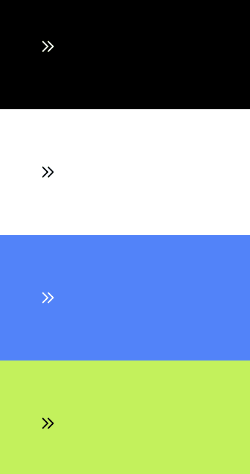

# Out-click for Tailwind

This is a plugin for Tailwind which introduces a configurable 'out-click' animation.

It's really difficult to neatly specify different duration timings for different CSS properties with Tailwind, so I made this plugin.

This is the what the effect looks like:



## Usage

### Include the plugin in `tailwind.config.js`

```js
const outclick = require('@akocan98/tailwind-out-click');

module.exports = {
    // ...
    plugins: [ 
        outclick,
        //...
    ],
    
};
```

### Minimal example

```html
<div class="out-click-200"> 
    Hello World
</div>
```

### Different colored out-click effect

You can tweak the colors of the out-click effect by specifying the `active:bg-color` and `active:outline-color` utility classes (or through other means, if necessary).

An example of this:

```html
<div class="out-click-200 active:bg-red-400/10 active:outline-red-400/10">
    Hello, world
</div>
```

### Adding an additional variation

You can add additional variations to specify your own transition durations. They are specified in `tailwind.config.js`, as such:

```js
const outClick = require('@akocan98/tailwind-out-click');

module.exports = {
    theme: {
        outClick: {
            999: {
                background: '333ms',
                outline: '666ms',
            }
        }
    },
    plugins: [outClick],
    // ...
}
```

this will generate an additional utility class:

```html
<div class="out-click-999">
    Hello, world
</div>
```

### As expected, you can use the utility class in your CSS

```scss
// ...
@tailwind components;

@layer components {
    .red-out-click {
        @apply out-click-200 active:bg-red-300 active:outline-red-300;
    }
}
// ...
```

### Example of different colours for light and dark mode

Example of combining:

```html
<div class="out-click-200 active:bg-red-400/10 active:outline-red-400/10 dark:active:bg-purple-400/10 dark:active:outline-purple-400/10">
    Hello, world
</div>
```

----

### Full example (Tailwind CSS & React.js)

```jsx
<>
    <div className={'p-20 bg-white dark:bg-black'}>
        <div
            className={
                'w-14 h-14 rounded-full out-click-200 active:bg-gray-300 dark:active:bg-white/20 active:outline-gray-300 dark:active:outline-white/20 flex justify-center items-center cursor-pointer'
            }>
            <svg
                xmlns="http://www.w3.org/2000/svg"
                className="h-6 w-6"
                fill="none"
                viewBox="0 0 24 24"
                stroke="white"
                stroke-width="2">
                <path stroke-linecap="round" stroke-linejoin="round" d="M13 5l7 7-7 7M5 5l7 7-7 7" />
            </svg>
        </div>
    </div>
</>
```
